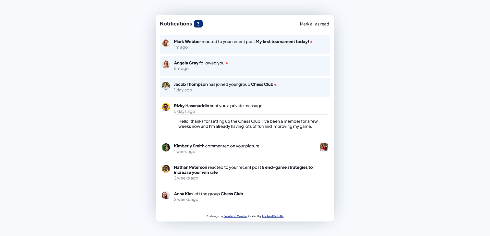

# Frontend Mentor - Notifications page solution

This is a solution to the [Notifications page challenge on Frontend Mentor](https://www.frontendmentor.io/challenges/notifications-page-DqK5QAmKbC). Frontend Mentor challenges help you improve your coding skills by building realistic projects. 

## Table of contents

- [Frontend Mentor - Notifications page solution](#frontend-mentor---notifications-page-solution)
  - [Table of contents](#table-of-contents)
  - [Overview](#overview)
    - [The challenge](#the-challenge)
    - [Screenshot](#screenshot)
    - [Links](#links)
  - [My process](#my-process)
    - [Built with](#built-with)
    - [What I learned](#what-i-learned)
    - [Continued development](#continued-development)
  - [Author](#author)

**Note: Delete this note and update the table of contents based on what sections you keep.**

## Overview

### The challenge

Users should be able to:

- Distinguish between "unread" and "read" notifications
- Select "Mark all as read" to toggle the visual state of the unread notifications and set the number of unread messages to zero
- View the optimal layout for the interface depending on their device's screen size
- See hover and focus states for all interactive elements on the page

### Screenshot

### Links

- Solution URL: [Add solution URL here](https://your-solution-url.com)
- Live Site URL: [Add live site URL here](https://your-live-site-url.com)

## My process
I broke this page down in the following ways:
1. Analyze the design and requirements and styling documentation
2. Build out HTML structure such that items that align will use common containers (i.e. time since post and the content of the notification)
3. Use CSS to form the mobile layout
4. Adjust desktop layout as necessary (unnecessary for this project)
5. Add default styling for content (i.e. fonts, colors, spacing)
6. Add styling for active states
7. Add unread notification styling and ability to remove unread status
### Built with

- Semantic HTML5 markup
- CSS custom properties
- Flexbox
- Mobile-first workflow

### What I learned

This project gave me a better feel for how to structure HTML to enable easier CSS styling while still having meaningful semantics.

### Continued development

I would like to try to integrate this sort of item into a Next.js project while working with real data, rather than having unread notifications already decided.

## Author

- Website - [Michael Schultz](https://mschultz-portfolio.herokuapp.com/)
- Frontend Mentor - [@ms097530](https://www.frontendmentor.io/profile/ms097530)

